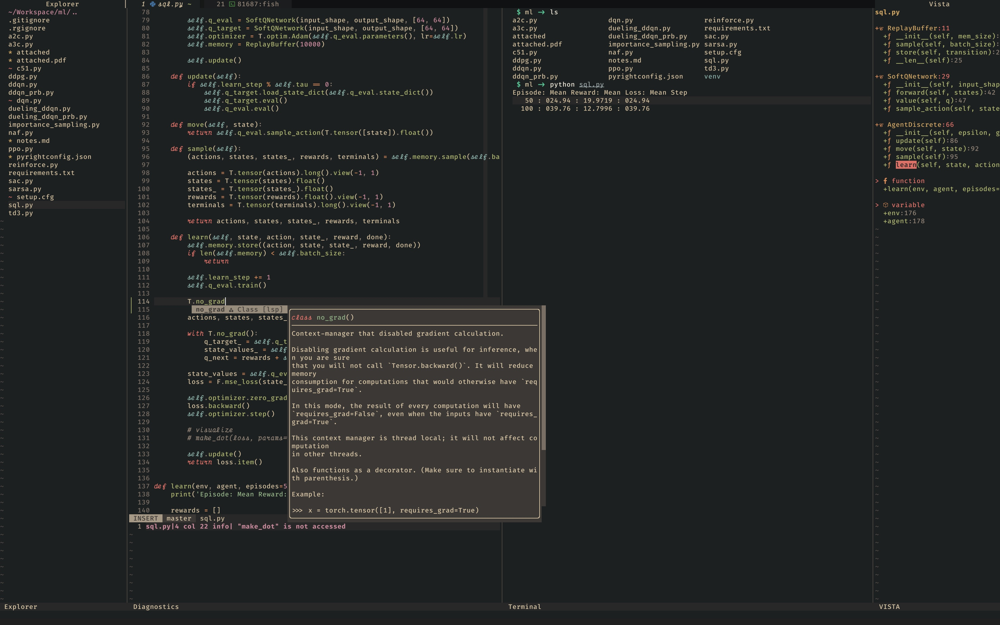

# ViRu-ThE-ViRuS
### Custom Configs FTW!!

Here are the configurations I use for my dev setups.

### Setup
- **TERMINAL**: Kitty [iterm2, alacritty] + TMUX
- **EDITOR**: Neovim
- **SHELL**: fish [zsh, bash]
- **PKG**: brew
- **MISC**: Tiles (MacOS), fzf, rg, batcat,

#### Neovim
my `NeoVim` configuration is heavily customized, and designed to work with the other elements of my env.
- custom statusline (with info from lsp, git, diagnostics, outline, and more, also handles truncation levels)
- custom lsp handlers (like qfrename, custom hover rendering)
- custom terminal setup (keymaps to send commands, toggle terminal, and other tricks)
- lsp augroups (popups, hovers, signature help etc)
- features like word-highlight, qf/loclist/diagnostic/outline navigation, buffer management, fzf-tools etc
- colorscheme and neovim quirks solved

##### LSP
you will need to install lsp(s) manually
- **lua**: sumneko (${HOME}/.local/lsp/lua-language-server/)
- **python**: pyright, pylsp
- **c/c++**: clangd (clang-format)
- **general**: efm (luafmt, autopep8)

##### Project Setup
- see colors: `so $VIMRUNTIME/syntax/hitest.vim`
- **.nvimrc**: nvim setup like venv
- **.rgignore**: ripgrep ignore
- **.clang-format**: clang-format config
- **.pep8**: autopep8 config
- **pyrightconfig.json**: pyright config

### Reproduce
- run `source update_config.sh` after creating desired config dirs
- run `source update_repo.sh` after updating local config, and populating repository

### Notes
- setup terminfo profile using `tic -x ~/.config/tmux/terminfo` for colors and fonts
- iTerm2 profile configuration is `iterm2/Virus.json`
- brew list output in `brew_output.txt`
- setup fonts according to `kitty/kitty.conf`
- periodically use `brew cleanup --prune 5; brew doctor`
- periodically glance over unnecessary packages `brew leaves`
- periodically update brew casks after checking `brew update ; brew upgrade`
