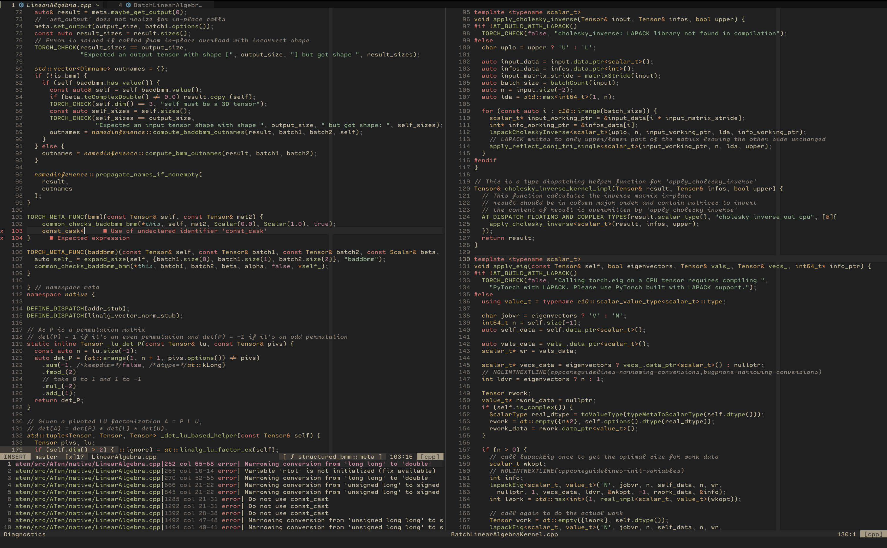

# ViRu-ThE-ViRuS

my dev setup :)

### Setup

- **TERMINAL**: kitty [ + TMUX ]
- **EDITOR**: neovim
- **SHELL**: fish
- **PKGs**: brew
- **DE**: tiles (MacOS)

#### Neovim

everything in this config was added piecewise, based on the explicit need for
something in my workflow. ive spent a lot of time optimizing for:

- speed (startuptime ~5ms, lazyloading almost everything)
- no bloat (only features i use regularly)
- custom implementation instead of pulling in new plugins for everything

some things i decided to implement on my own:

- notifications (for lsp, dap, +more)
- statusline (with lsp, git, diagnostics, outline, truncation, +more)
- lsp handlers (quickfix list, notifications, +more)
- terminal setup (send commands, toggle, run last, notifications, +more)
- small utilities like highlight current word, switch bw preferred colorschemes,
  collect all TODOs, toggle maximise buffer, etc

i recommend using `neovim HEAD` (or atleast 0.6+) to keep up with latest config
changes.

##### LSP

you will need to install lsp(s) manually:

- **lua**: sumneko (${HOME}/.local/lsp/lua-language-server/)
- **cmake**: cmake-language-server
- **python**: pyright
- **c/c++**: clangd, clang-format, clang-tidy
- **general**: null-ls (lua_format, autopep8, prettier, flake8), universal-ctags

##### DAP

for my dap setup to work, you will need to install adapters manually

- **python**: debugpy
- **c/c++/rust**: codelldb (${HOME}/.local/codelldb/)

##### Project Setup

- see colors: `so $VIMRUNTIME/syntax/hitest.vim`
- **.clang-format**: clang-format config
- **.clang-tidy**: clang-tidy config
- **.flake8**: autopep8/flake8 config
- **pyrightconfig.json**: pyright config

### Reproduce

- run `source update_config.sh` to update local config
- run `source update_repo.sh` to update the repo with latest local config

### Notes

- tmux: setup terminfo profile using `tic -x ~/.config/tmux/terminfo`
- brew: packages in `brew_output.txt` & `brew_cask_output.txt`
- kitty: setup fonts according to `kitty/kitty.conf`
- periodically use `brew cleanup --prune 5; brew autoremove; brew doctor`
